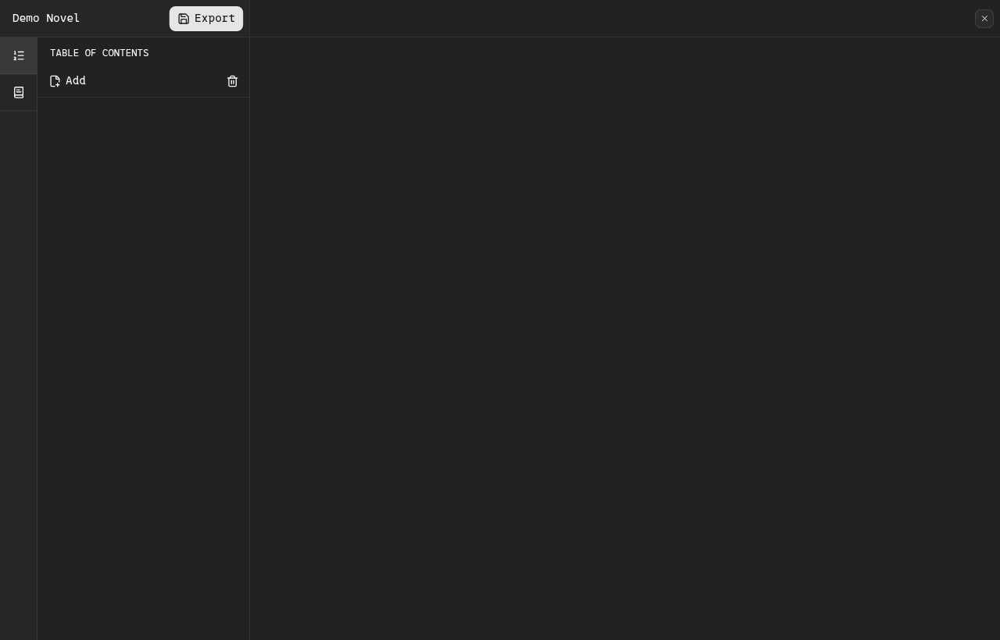
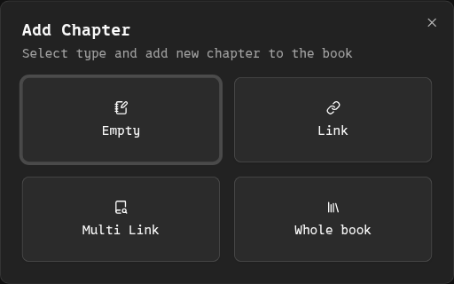
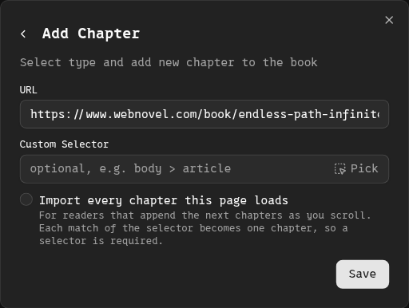
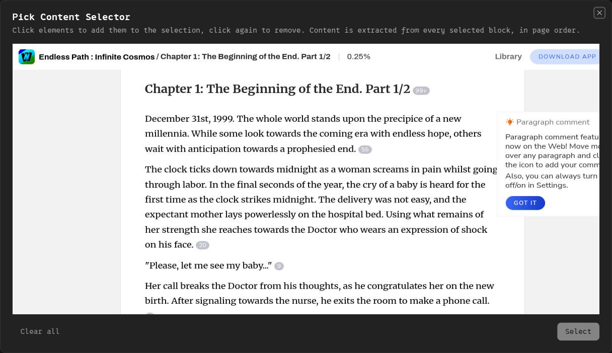
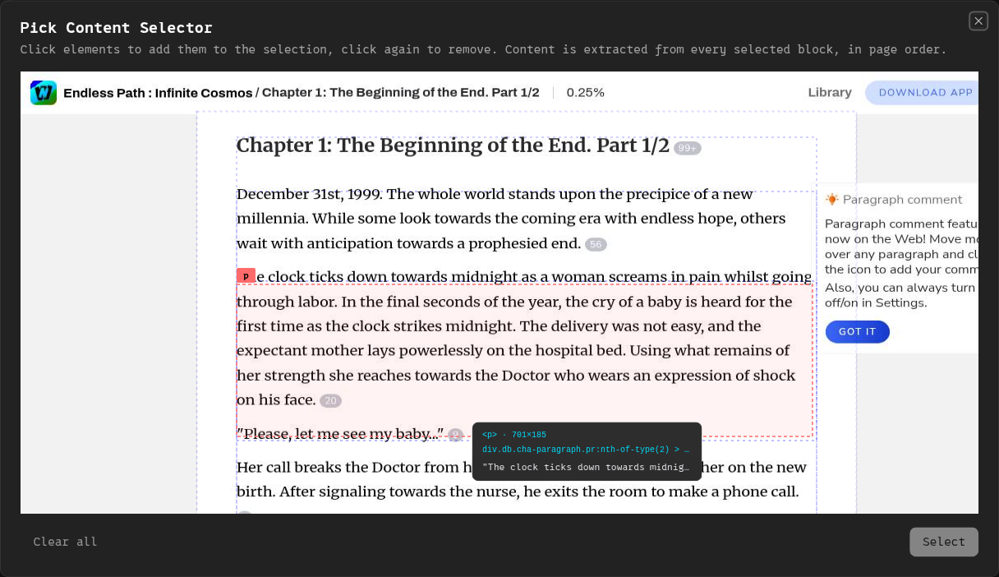
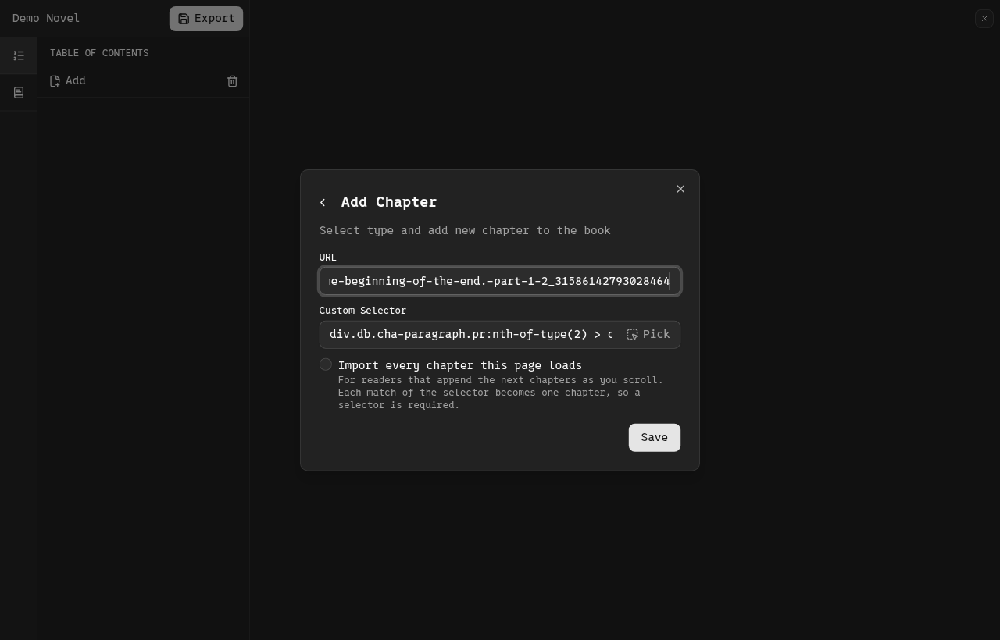
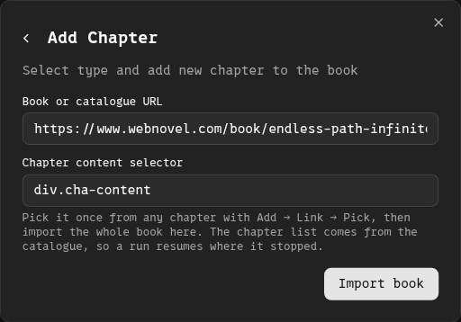
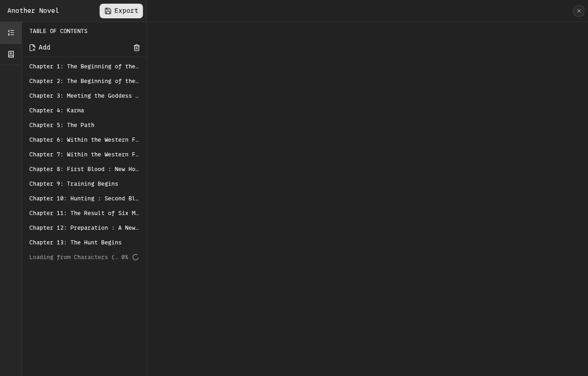
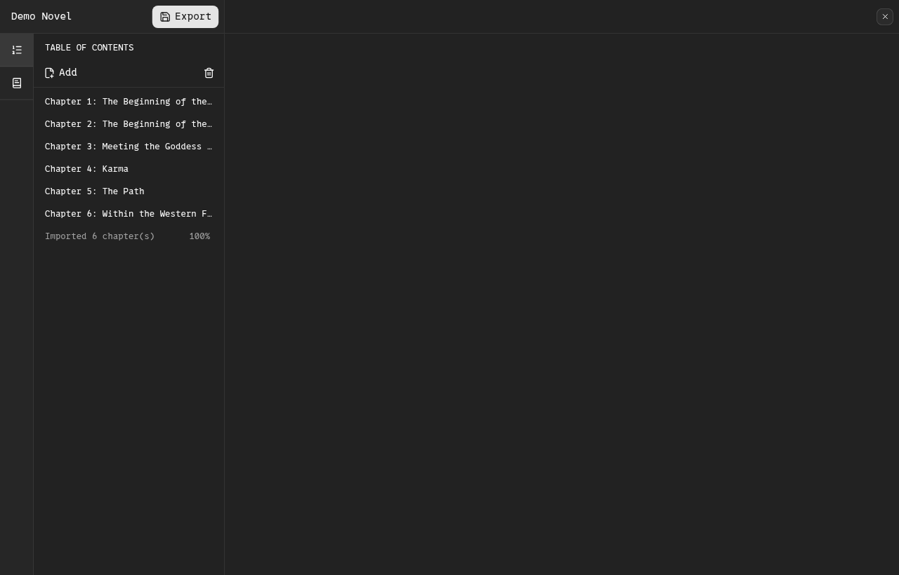

# Importing a whole book

Storvi can take a book's landing page, work out where its chapter list lives, and
import every chapter on that list — then resume if it stops. This walks through it
with the real UI.

Two things have to be true first: you have a **project** to import into, and you
know which **selector** picks a chapter's content on that site. Getting the second
one is the only part that needs thought, so it is step one.

---

## 1. Get a content selector, once per site

A selector is just the CSS that finds the chapter body on a *chapter* page. The
app finds it for you.



Open the project and click **Add**.



Choose **Link**. This mode is for "one page in front of me" — it is where the
picker lives.



Paste the URL of **any chapter** (not the book's front page) and press **Pick**
beside the selector field.



The page loads inside the picker. Move the mouse over the chapter text: whatever is
under the cursor is outlined, and its selector is shown.



Click the block you want — everything you click is added to the selection, and
clicking again removes it — then press **Select** to confirm.



The picker hands the selector back to the form. You do not need to import this
chapter; you came here for the selector. If the picker lands on something too
small (a single paragraph, say), type the container instead: on the site used
here, `div.cha-content` covers a whole chapter, and the field's own placeholder
suggests exactly that kind of value.

> **A note on what to pick.** The selector is applied to *every* chapter page of
> that site, so it has to be stable. Prefer a named container over a deep path
> containing `:nth-of-type(...)` — positional selectors are fine on the page you
> picked them on and wrong on the next one. A site that splits its body across
> several blocks is handled by selecting each of them.

## 2. Import the book



Back in the table of contents, **Add → Whole book**. Put the **book's** URL (or its
catalogue URL — either works; the app follows the catalogue link from the book
page) and the selector you just picked, then press **Import book**.

Nothing else is needed: the chapter list, their order and their titles all come
from the catalogue the site publishes, not from what happens to be rendered.

## 3. While it runs



Chapters appear in the table of contents as they arrive, with the status line
showing what it is loading. Two things that look like problems but are not:

- **The percentage tracks the catalogue, not the clock.** A 2,000-chapter book
  sits near `0%` for a long while and then moves quickly; the chapter list is the
  honest progress bar.
- **Other browser work is refused while it runs.** One run holds the single
  browser slot, so a snapshot or another import answers
  `429 WORKLOAD_LIMIT_REACHED` until it finishes.



When it ends, the status line reports what was imported.

## Stopping, resuming, and limiting

- **Resume is safe and built in.** Every imported chapter's source id is recorded,
  so submitting the same book again imports only what is missing. This is what to
  do after a failure, a restart, or a stop.
- **A page that fails no longer kills the run.** It is skipped, stays eligible, and
  a later run retries it. Five failures *in a row* stop the walk with a message —
  that means a wrong selector or a site refusing us, not a blip.
- **The UI has no chapter cap; the API does.** For a first run against an unknown
  site, bound it:

  ```bash
  curl -X POST -H "Authorization: Bearer $API_TOKEN" -H 'Content-Type: application/json' \
    -d '{"bookUrl":"https://site/book/123","selector":"div.cha-content","maxChapters":5}' \
    http://127.0.0.1:3000/api/projects/<project-id>/chapters/import-book
  ```

  Five chapters arrive, you read one, and if it looks right, run it again without
  `maxChapters` — the ledger skips the five you already have.

## Checking the result

Read the first imported chapter before trusting a long run: it should start where
the chapter starts, end where it ends, and contain no author's note, comment
strip, adverts, or "related" block. Those are removed automatically, but a
selector that also catches navigation will show up here first.

Chapter word counts are the quickest sanity check. Roughly consistent,
hundreds-to-low-thousands of words per chapter means the selector is finding the
body; wildly large counts mean it is catching the page shell, and tiny ones mean
it is catching a single paragraph.

## Getting a selector without the picker

The picker is the normal way. Two alternatives:

- **By hand** — in your browser's inspector, find the smallest element that holds
  the whole chapter and nothing else, and prefer semantic class names over hashed
  ones (`cha-words` over `cl54`).
- **Ask a model** — `POST /api/projects/generate-selectors` with a page's HTML
  returns title/chapter/content selectors (it needs a configured AI backend; see
  the README's *AI selector generation*). This is API-only today: the picker has
  no AI button.
